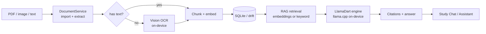

<div align="center">


# Moonlight Study ☕

**A local, offline AI study companion with a coffee + lo-fi soul.**

Read, annotate, and ask questions grounded in *your* documents — everything runs
**on-device** on an embedded llama.cpp. No accounts, no uploads, no internet
required.

[](https://flutter.dev)
[](.github/workflows/ci.yml)
[](LICENSE)
[]()
[]()
[](https://dart.dev)

</div>

---

## Table of contents

- [What is Moonlight Study?](#what-is-moonlight-study)
- [Features](#features)
- [How it works](#how-it-works)
- [Screenshots](#screenshots)
- [Tech stack](#tech-stack)
- [Getting started](#getting-started)
- [Model catalog](#model-catalog)
- [Project structure](#project-structure)
- [Configuration & privacy](#configuration--privacy)
- [CI & quality gates](#ci--quality-gates)
- [Contributing](#contributing)
- [Roadmap](#roadmap)
- [License](#license)

---

## What is Moonlight Study?

Moonlight Study is a warm, cozy study companion that turns a pile of PDFs into a
searchable, answerable, *personal* knowledge base — without ever leaving your
machine.

It pairs a **full-featured PDF reader and notebook** with a small **on-device
language model** that can:

- answer questions **grounded in your own documents**, with source citations,
- **transcribe scanned PDFs** via on-device vision OCR,
- generate **smart flashcards** and **study plans** from the material you upload,
- and keep the vibe going with a **Pomodoro timer**, **lo-fi ambience**, and a
  local **music player**.

Because inference, embeddings, and retrieval all run locally, the app works
completely offline and your data stays yours.

---

## Features

### 📚 Reader & notebook
- **PDF reader** with a draggable split view, page thumbnails, fit-width /
  fit-page modes, and **sepia / paper / midnight** reading themes.
- **Annotate** right from a selection: **Highlight · Summarize · Explain ·
  Copy**, plus editable **sticky notes** with undo/redo. Highlights are stored
  per-line as page-normalized rects, so they survive zoom.
- **Night reading** toggle that genuinely inverts white pages for low-light
  study.
- **Per-PDF notes** — bullet-style, auto-saved as you type, scoped to the file
  you're reading.

### 🧠 On-device AI
- **Grounded Study Chat** — answers are retrieved (RAG) from your documents and
  tagged with inline source citations like `[1]`, `[2]`.
- **Vision OCR** — scanned/image PDFs are transcribed on-device at index time,
  making even image-only text searchable and answerable.
- **Notebook assistant** — one AI teammate per notebook, scoped to exactly the
  material you're studying.
- **Reasoning models** — chain-of-thought is rendered in a collapsible
  Reasoning block (e.g. DeepSeek-R1-Distill).
- **Auto memory** — the app remembers goals, preferences, and knowledge gaps to
  tailor answers across sessions.

### 🎴 Flashcards & planning
- **Smart flashcards** — auto-generate Q/A decks from a notebook or chosen PDFs,
  or add manual cards; study in spaced sessions.
- **Study planner** — plan sessions, flashcard decks, and exam countdowns.
- **Pomodoro timer** with a 25/5 focus-break loop and **lo-fi ambience**.

### 🎵 & 🎨 Vibe
- **Music player** — point at a local folder; browse playlists and control
  playback from anywhere (even the reader's header).
- **Coffee + lo-fi design system** — a custom `CoffeeColors` palette, Fraunces
  serif / WorkSans type, and a vinyl-inspired app icon.
- **Light & dark** themes across every screen.

---

## How it works



- **Ingestion.** Files are copied into the app's documents folder, text is
  extracted (or restored via vision OCR when a scanned page has none), then
  split into 700-char chunks with 100-char overlap.
- **Indexing.** Each chunk is embedded with a lightweight local model (falling
  back to keyword scoring when no embedding model is loaded), then stored in
  SQLite via Drift.
- **Retrieval.** A question is matched against the chunks semantically (or by
  keyword), the top results are packed into a prompt with citations, and the
  small local model streams the answer **and** its chain-of-thought back to the
  UI, rendered as a collapsible Reasoning block.

---

## Screenshots

> Screenshots live in [`docs/screenshots/`](docs/screenshots/) — drop them in as
> you capture them. Placeholder art below:

| Dashboard & timer | Reader with notes | PDF annotations |
| :-: | :-: | :-: |
| *coming soon* | *coming soon* | *coming soon* |

---

## Tech stack

| Layer | Choice |
| --- | --- |
| Framework | [Flutter](https://flutter.dev) (3.x) |
| State | [Riverpod 2](https://riverpod.dev) (Notifier / Stream providers) |
| Database | [Drift](https://drift.simonbinder.eu) (SQLite) + codegen |
| PDF | [pdfrx](https://pub.dev/packages/pdfrx) |
| On-device LLM | [llamadart](https://pub.dev/packages/llamadart) (llama.cpp) |
| Audio | [just_audio](https://pub.dev/packages/just_audio) |
| Markdown / math | flutter_markdown · flutter_math_fork |
| Preferences | SharedPreferences |
| Networking | dio (model downloads + optional external API) |

---

## Getting started

### Prerequisites

- **Flutter 3.x** ([install](https://docs.flutter.dev/get-started/install)),
  on the stable channel.
- Platform toolchains for your target: Xcode + CocoaPods (macOS/iOS),
  Visual Studio (Windows), GTK (Linux), or Android SDK/NDK (Android).

### Clone & run

```bash
git clone <your-fork-or-upstream-url>.git
cd <repo>/app
flutter pub get
flutter run -d macos    # or windows / linux / android / ios
```

> **First AI use.** Models are large GGUF files that `llamadart` downloads
> automatically the first time you open the **Models** screen and pick one
> (they're cached locally, never committed). Expect one-time downloads of a few
> hundred MB. OCR of scanned PDFs needs a **vision** model.

### Unit tests

```bash
cd app
flutter test test/navigation_test.dart test/pomodoro_test.dart test/latex_syntax_test.dart
```

`smoke_test.dart` and `qwen_vl_test.dart` download real GGUF models from
HuggingFace (10–15 min) and are **not** part of the normal quick-check path.

---

## Model catalog

Small, efficient, and fully on-device — hand-picked to run on consumer hardware
at `contextSize: 4096`, CPU-only:

| Model | Type | Capabilities | Notes |
| --- | --- | --- | --- |
| `qwen2.5-vl-3b` | Vision | chat · vision | **Default.** Also loads `mmproj`. Best for OCR. |
| `qwen2.5-1.5b` | Text | chat | Lightweight generalist. |
| `deepseek-r1-1.5b` | Text | chat · reasoning | STEM-friendly, emits chain-of-thought. |
| `qwen2.5-3b` | Text | chat | Larger text option for machines with >8GB RAM. |
| `phi-3-mini` | Text | chat | Small, fast. |
| `smolLM2-135m` | Text | chat | Tiny smoke-test model for CI/dev machines. |

**Capabilities** (`AiCapability`) — `chat`, `vision`, `embeddings`, `reasoning` —
drive which parts of the app light up. Embeddings need a model that supports
them, otherwise RAG falls back to keyword scoring.

> ⚠️ **Model gating.** Only models whose GGUFs come from **verified-public**
> repos ship in the catalog. Gated repos (many official/unsloth Qwen3 GGUFs)
> return HTTP 401 and break unattended in-app downloads. New models are added
> only after their resolve URL is verified reachable.

---

## Project structure

```
app/
├─ lib/
│  ├─ core/          # theme · ai engine · db · settings · state · window · music · audio
│  ├─ features/      # dashboard · notebooks · reader · chat · flashcards · planner
│  │                 # models · settings · music
│  ├─ docs/          # document_service · rag_service · ocr_service · prompt_builder · data_repair
│  ├─ study/         # pomodoro + study actions
│  ├─ shared/        # reusable coffee-style widgets
│  └─ main.dart      # entrypoint (frameless desktop window via window_manager)
├─ test/             # fast offline unit tests (CI-only)
├─ macos/ ios/ windows/ linux/ android/   # platform scaffolds
└─ tool/             # generate_logo.dart draws the vinyl + crescent icon
```

A deeper architecture reference (including cross-feature gotchas) lives in
[`AGENTS.md`](AGENTS.md).

---

## Configuration & privacy

- **Everything is local.** Documents, notes, memory, flashcards, and the LLM
  run on-device. The only network calls are: (1) downloading GGUF models, and
  (2) an **optional** external OpenAI/Anthropic-compatible endpoint you
  configure yourself.
- **Settings** are stored in SQLite (Drift key/value) and SharedPreferences.
- **macOS** runs sandboxed with `com.apple.security.files.user-selected.read-only`
  so you can safely pick a PDF or music folder via a security-scoped bookmark.
- See [SECURITY.md](.github/SECURITY.md) for the supply-chain and data-handling
  notes.

---

## CI & quality gates

- `.github/workflows/ci.yml` runs on every push / PR to `main`:
  - `flutter analyze` (0 issues required)
  - fast, offline unit tests
  - a **drift codegen in-sync** check that fails if `app_database.g.dart`
    drifts from the schema
- The network-dependent smoke/OCR integration tests are intentionally excluded
  from CI.

---

## Contributing

We'd love your help. See [CONTRIBUTING.md](.github/CONTRIBUTING.md) for setup,
workflow, and style. Be kind — read the [Code of Conduct](.github/CODE_OF_CONDUCT.md).

---

## Roadmap

- [ ] Screenshots for the README
- [ ] Page-aware chunking (chunks currently carry `pageIndex: 0`)
- [ ] More verified-public reasoning & vision model sources
- [ ] Flashcard spaced-repetition scheduling
- [ ] Windows/Linux folder-picker bridge parity with the macOS one

---

## License

MIT © 2026 [Navatej Ratnan](mailto:navatejratnanpersonal@gmail.com). See [LICENSE](LICENSE).

<sub>Made with ☕ and lo-fi vibes.</sub>
