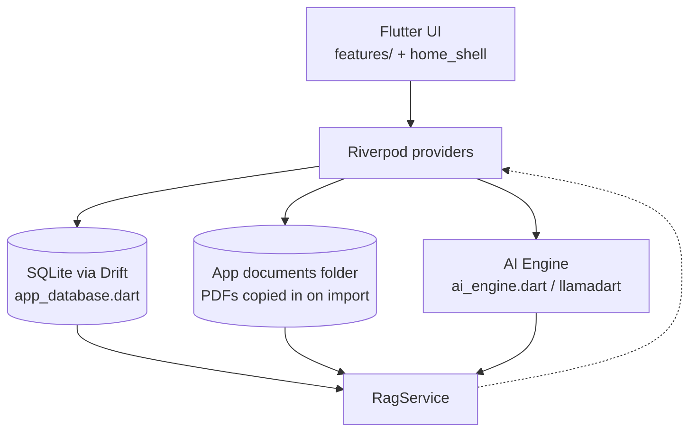

# Moonlight Study — Architecture

Moonlight Study is a local-first Flutter app: an embedded llama.cpp (
`llamadart`) runs entirely on-device, and every piece of study state lives in a
single SQLite database via Drift. This document describes the system at a level
that lets a new contributor reason about the whole app.



## Layers

### `lib/core/` — foundation

| Folder | Responsibility |
| --- | --- |
| `ai/` | `AiEngine` lifecycle (load/chat/embed, progress state), `ModelCatalog` (7 entries, `hf://` sources), `ModelStore` (SharedPreferences: `ai_enabled` + `active_model_id`), `soul.dart` (system prompt) |
| `db/` | Drift schema + `AppDatabase`. All 13 tables live here; `app_database.g.dart` is generated |
| `errors/` | Typed exceptions (`ModelDownloadError`, `PDFCorruptedError`, …) + `ErrorHandler.getUserMessage` mapping for friendly UI copy |
| `logging/` | `AppLogger` — rotating file logger (singleton, use `AppLogger()`) |
| `memory/` | Cross-session memory rows surfaced to the AI as context |
| `music/` + `audio/` | Music folder via security-scoped bookmarks + playback |
| `settings/` | `AppSettings` + `SettingsStorage` on the Drift `Settings` key/value table + SharedPreferences-backed `SettingsLoader` rehydration |
| `state/` | `appSectionProvider` (current section) + `themeModeProvider` |
| `theme/` | `CoffeeColors` + `AppTheme` (Fraunces serif / WorkSans) |
| `widgets/` | Generic non-feature widgets |
| `window/` | Frameless `window_manager` setup |

### `lib/docs/` — document pipeline

- **`document_service.dart`** — copies a chosen file into the app documents
  folder, extracts text with `pdfrx`, and chunks it (`size: 700`, `overlap: 100`,
  sentence-boundary aware).
- **`rag_service.dart`** — builds chunks + embeddings, then `retrieve()`:
  cosine similarity when embeddings are available, otherwise **keyword scoring
  fallback** (so retrieval works with no model loaded).
- **`ocr_service.dart`** — vision-model OCR for scanned PDFs (renders pages,
  asks the active vision model to transcribe them). Only active when a
  vision-capable model is loaded.
- **`prompt_builder.dart`**, **`data_repair.dart`** — prompt assembly, and a
  startup repair pass (dedupe document rows, re-index any chunk-less PDF).

### `lib/features/` — screens

`home_shell.dart` renders a sidebar rail at ≥960px and a bottom nav below; the
section comes from `appSectionProvider`. Reader is opened from the notebooks
screen. Onboarding gating happens in `app.dart`:
`onboardingComplete ? HomeShell : OnboardingScreen`.

### `lib/study/` — pomodoro + study actions

Pomodoro state machine (`pomodoro.dart`) and `StudyActions` (flashcard
generation, session logging).

## State management

Riverpod 2 (`flutter_riverpod`). Conventions:

- **Streams/queries** → `StreamProvider`; **mutable screen state** →
  `NotifierProvider` with `autoDispose` where appropriate; **settings** →
  `AsyncNotifier`.
- `appDatabaseProvider` is the single app-wide `AppDatabase` instance.
- `settingsProvider` is `AsyncNotifier` and `SettingsNotifier.apply(copyWith…)`
  persists to drift.
- AI providers: `aiEngineProvider` (engine lifecycle), `aiEnabledProvider`
  (master switch), `activeModelProvider` (persisted catalog entry).

### Gotchas

- **`readerAssistantProvider` is deliberately NOT autoDispose** — reader
  selection actions push queries while the Notes tab may be active; an
  autoDisposed conversation would be dropped before the answer streams.
- **`RagService` constructor** takes `(db, documentService, ocrService, ref)`;
  always resolve it through `ragServiceProvider` (it needs the Riverpod `ref`).
- **`AppLogger` is an instance, not static methods**: `AppLogger().info(...)`.
- **Drift column naming differs by table**: `Notebooks.title` vs
  `Documents.name`. Check the table definition, not the other table.

## Data flow: importing + querying a PDF

1. The user picks a PDF; `DocumentService.importDocumentAt` copies it into the
   app documents folder and creates a `Documents` row.
2. `RagService.indexDocument` chunks the extracted text (pages OCR'd first if
   the vision model says they're scanned) and stores `Chunks` rows with
   embeddings when the active model supports them.
3. `ReaderScreen` publishes the open PDF to `readingContextProvider`; the Study
   Chat scopes RAG to that document, falling back to the whole library when no
   reader is open.
4. `retrieve()` returns the top `k` scored `Chunks` (cosine or keyword), which
   the prompt builder injects as grounded context.

## AI engine lifecycle

```
idle → loading → downloading (progress %) → ready
        └──────────→ error (retryable)
```

All models load CPU-only with `contextSize: 4096`, `gpuLayers: 0`. If a saved
`huggingFaceToken` exists it is passed as `ModelLoadOptions.bearerToken`, so
gated repositories work once a read token is added in Settings → AI.

## Database

Schema in `app_database.dart` (`schemaVersion: 4`), codegen in
`app_database.g.dart` — regenerate with:

```bash
cd app && dart run build_runner build --delete-conflicting-outputs
```

Tables: `Documents`, `Chunks`, `Notebooks`, `NotebookDocuments`, `Flashcards`,
`FlashcardGroups`, `StudySessions`, `Notes`, `PdfAnnotations`, `Memories`,
`Playlists`, `PlaylistTracks`, `Settings`. Annotations are stored as
page-normalized rects (`PdfRectNorm`); text-selection highlights use
`AnnotationPayload.highlightRects` (per-line rects).

## Testing strategy

`AppDatabase` accepts an optional `QueryExecutor`, so tests use
`AppDatabase(NativeDatabase.memory())` (see `test/helpers/test_db.dart`) with
no `path_provider`/disk access. The **fast suite** runs in seconds and is CI
gated; the two slow integration tests (`smoke_test`, `qwen_vl_test`) download
real GGUF models and are excluded from CI. See `docs/development.md`.